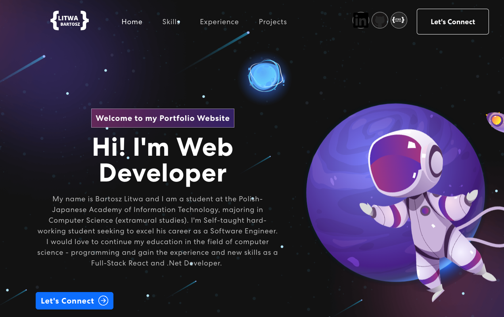

# 🚀 Bartosz Litwa - Personal Portfolio

A modern, minimalist portfolio website built with React, TypeScript, and Three.js. Showcasing professional experience as a .NET Developer 3 at KPMG, featuring my flagship project Rentifynow, and demonstrating expertise in full-stack development.

**Live Preview:** [https://www.litwa.dev](https://www.litwa.dev)



## ✨ Features

- **🎨 Minimalist Design**: Clean, modern dark theme with purposeful animations
- **🏆 Featured Project Section**: Highlighting Rentifynow.com - my flagship SaaS platform
- **💼 Professional Skills Display**: Modern card-based layout showcasing .NET, Angular, Azure DevOps expertise
- **🔍 SEO Optimized**: Comprehensive meta tags, structured data, and sitemap for search engines
- **🌐 3D Interactive Elements**: Rocket and laptop models using Three.js
- **📱 Fully Responsive**: Optimized for all device sizes
- **⚡ Performance Optimized**: Lazy loading, code splitting, and image optimization
- **🔒 Secure**: Environment variables for sensitive data
- **♿ Accessible**: ARIA labels, keyboard navigation, and reduced motion support
- **🛡️ Error Boundaries**: Graceful error handling throughout the app
- **📧 Contact Form**: Integrated with EmailJS for direct communication
- **🌍 Multi-language**: Support for English and Polish

## 🛠️ Tech Stack

### Professional Expertise (Highlighted in Portfolio)
- **.NET Core / C#** - Backend development and enterprise applications
- **Angular / TypeScript** - Modern frontend framework
- **Azure DevOps** - CI/CD pipelines and infrastructure
- **GitHub Actions** - Workflow automation
- **Azure Cloud** - Cloud infrastructure and services
- **Docker & Kubernetes** - Containerization and orchestration

### Portfolio Technologies
- **React 18** - Modern React with hooks and concurrent features
- **TypeScript** - Type-safe development
- **Three.js + React Three Fiber** - 3D graphics and animations
- **React Bootstrap** - Responsive UI components
- **EmailJS** - Contact form functionality

### Build Tools & Development
- **Create React App** - Build toolchain
- **ESLint & TypeScript** - Code quality and type checking
- **GitHub Pages** - Deployment platform

## 🚀 Quick Start

### Prerequisites
- Node.js (v16 or higher)
- npm or yarn

### Installation

1. **Clone the repository**
   ```bash
   git clone https://github.com/BartoszLitwa/bartoszlitwa.github.io.git
   cd bartoszlitwa.github.io
   ```

2. **Install dependencies**
   ```bash
   npm install --legacy-peer-deps
   ```

3. **Set up environment variables**
   ```bash
   cp .env.example .env
   ```
   
   Edit `.env` and add your EmailJS credentials:
   ```env
   REACT_APP_EMAILJS_SERVICE_ID=your_service_id
   REACT_APP_EMAILJS_TEMPLATE_ID=your_template_id
   REACT_APP_EMAILJS_PUBLIC_KEY=your_public_key
   ```

4. **Start development server**
   ```bash
   npm start
   ```

5. **Open your browser**
   Navigate to [http://localhost:3000](http://localhost:3000)

## 📁 Project Structure

```
src/
├── components/           # React components
│   ├── Banner/          # Hero section with animated text
│   ├── FeaturedProject/ # Rentifynow highlight section
│   ├── Contact/         # Contact form with 3D laptop
│   ├── Experience/      # Work experience timeline
│   ├── Projects/        # Project showcase with filtering
│   ├── Skills/          # Professional skills with modern card layout
│   ├── Certifications/  # Professional certifications
│   ├── NavBar/          # Navigation component
│   ├── Footer/          # Footer component
│   └── ErrorBoundary/   # Error handling component
├── data/                # JSON data files
│   ├── projects.json    # Project information (featured + others)
│   ├── experience.json  # Work experience data
│   ├── skills.json      # Skills and technologies
│   ├── certifications.json # Professional certifications
│   └── translations.json   # Multi-language support
├── types/               # TypeScript type definitions
├── hooks/               # Custom React hooks
├── assets/              # Images and static files
└── App.tsx             # Main application component
```

## 🎯 Key Components

### Featured Project Section
- **Rentifynow Showcase**: Dedicated section highlighting my flagship SaaS platform
- **Technical Stack Display**: Visual representation of technologies used
- **Key Features List**: Showcasing enterprise-grade capabilities
- **Metrics Cards**: Highlighting multi-tenant architecture, real-time features, Azure cloud, and enterprise security

### Professional Profile
- **.NET Developer 3 @ KPMG**: Updated title reflecting recent promotion
- **BSc Computer Science**: Education credentials displayed
- **4 Years Experience**: Updated career stats
- **15+ Services Built**: Showcasing microservices expertise
- **90% Cost Savings**: Proven track record of optimization

### 3D Models
- **Rocket Scene**: Interactive space-themed 3D model in the hero section
- **Laptop Model**: Floating laptop with embedded HTML content in contact section

### Data Management
- All content is externalized to JSON files for easy updates
- TypeScript interfaces ensure type safety
- Dynamic image loading with proper error handling
- Multi-language support (English/Polish)

### Performance Features
- **Lazy Loading**: Components load on demand
- **Code Splitting**: Automatic bundle optimization
- **Image Optimization**: Lazy loading for images
- **Error Boundaries**: Prevent crashes from component errors
- **Scroll Animations**: Smooth reveal animations on scroll

## 🚀 Deployment

### GitHub Pages (Current)
```bash
npm run deploy
```

### Manual Build
```bash
npm run build
# Deploy the 'build' folder to your hosting provider
```

## 🔧 Configuration

### EmailJS Setup
1. Create an account at [EmailJS](https://www.emailjs.com/)
2. Create a service and template
3. Add your credentials to `.env` file

### Customization
- **Projects**: Edit `src/data/projects.json` (mark projects as `featured: true` to highlight)
- **Experience**: Edit `src/data/experience.json` (add `education` field for credentials)
- **Skills**: Edit `src/data/skills.json` (add/remove categories and skills)
- **Translations**: Edit `src/data/translations.json` (English and Polish content)
- **Certifications**: Edit `src/data/certifications.json`
- **SEO**: Update `public/index.html` for meta tags and structured data
- **Styling**: Modify CSS files in component directories
- **Theme Colors**: Update CSS variables in `src/App.css` for custom color schemes

## 🔍 SEO Features

This portfolio is optimized for search engines with:

### Technical SEO
- ✅ Comprehensive meta tags (title, description, keywords)
- ✅ Open Graph tags for social media sharing
- ✅ Twitter Card integration
- ✅ Structured data (Schema.org JSON-LD)
- ✅ XML sitemap with priority-based indexing
- ✅ Optimized robots.txt
- ✅ Canonical URLs
- ✅ Mobile-first responsive design

### Content SEO
- ✅ Semantic HTML5 structure
- ✅ Proper heading hierarchy (H1, H2, H3)
- ✅ Alt text for images
- ✅ Descriptive link text
- ✅ Fast loading times
- ✅ Accessibility compliance (WCAG 2.1)

### Tools & Validation
Run these to verify SEO implementation:
- [Google Rich Results Test](https://search.google.com/test/rich-results)
- [Google Mobile-Friendly Test](https://search.google.com/test/mobile-friendly)
- [PageSpeed Insights](https://pagespeed.web.dev/)
- Chrome DevTools > Lighthouse

For detailed SEO documentation, see [SEO_IMPLEMENTATION.md](SEO_IMPLEMENTATION.md)

## 🐛 Troubleshooting

### Common Issues

1. **Dependency conflicts**
   ```bash
   npm install --legacy-peer-deps
   ```

2. **3D models not loading**
   - Ensure GLTF files are in the public directory
   - Check browser console for loading errors

3. **Contact form not working**
   - Verify EmailJS environment variables
   - Check network tab for API calls

## 🤝 Contributing

1. Fork the repository
2. Create a feature branch: `git checkout -b feature/amazing-feature`
3. Commit changes: `git commit -m 'Add amazing feature'`
4. Push to branch: `git push origin feature/amazing-feature`
5. Open a Pull Request

## 📝 License

This project is open source and available under the [MIT License](LICENSE).

## 📞 Contact

**Bartosz Litwa**
- Website: [litwa.dev](https://litwa.dev)
- LinkedIn: [bartoszlitwa](https://www.linkedin.com/in/bartoszlitwa/)
- GitHub: [BartoszLitwa](https://github.com/BartoszLitwa)
- Email: bartosz.litwa@proton.me

---

⭐ **If you found this project helpful, please give it a star!**